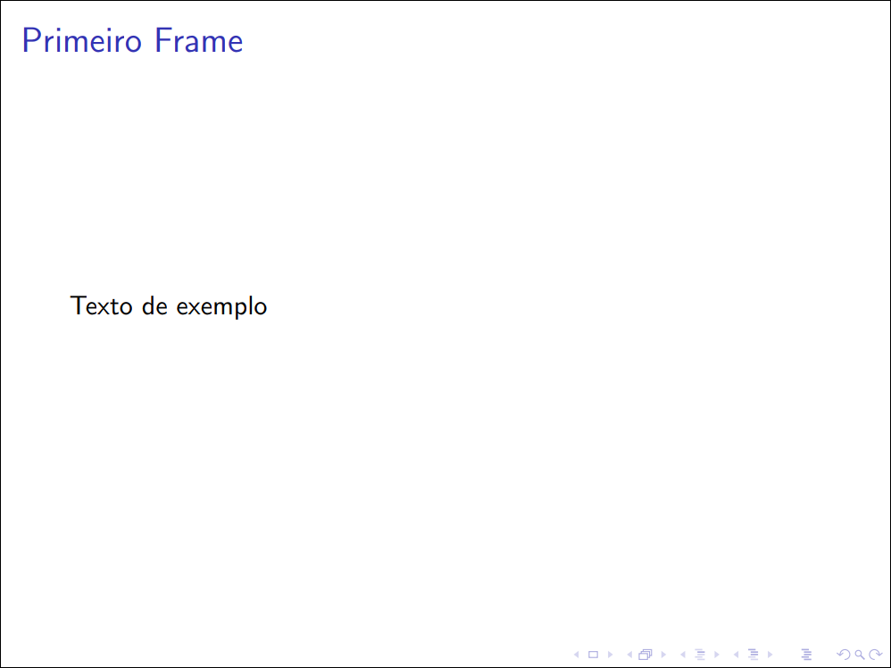

Estrutura geral e classes
=========================

Arquivos LaTeX são organizados, em resumo, da seguinte forma:

1. Classe do documento
2. Preâmbulo
3. Documento

Na **classe do documento** se define justamente que tipo de documento se trata.
As classes principais são:
- `article`: Apesar do nome, serve para documentos no geral (o que inclui
  também artigos científicos).
- `book`: Para livros;
- `beamer`: Para apresentações de slides.

Há várias outras classes que podem ser interessantes, dependendo do tipo de
documento. Você pode checar algumas delas [na introdução a LaTeX do
Overleaf](https://www.overleaf.com/learn/latex/Creating_a_document_in_LaTeX#Reference_guide).

Prática
-------

Esboce seu primeiro documento seguindo os passos:
1. Escolha uma das classes de sua vontade;
2. Crie um arquivo de texto (em branco) chamado `main.tex` (o nome pode ser
   qualquer um, na verdade, mas para fins de nos entendermos por aqui, o
   chamarei de `main.tex`);
3. Nesse arquivo, escreva `\documentclass{<classe>}`, trocando `<classe>` pela
   classe de documento escolhida. Por exemplo, para a `article`, seu documento
   será:

   ```latex
   \documentclass{article}
   ```

4. Escreva alguma frase para o conteúdo do seu documento. O conteúdo do seu
   documento deve ficar entre uma linha contendo `\begin{document}` e outra
   contendo `\end{document}`. Por exemplo:

   ```latex
   \begin{document}
       Texto de exemplo
   \end{document}
   ```

5. Utilize seu compilador para gerar o PDF a partir do `main.tex`, por exemplo:

   ```console
   $ xelatex main.tex
   ```

Tendo feito esses 5 passos, você agora terá um arquivo `main.pdf`. Abaixo
seguem tanto o código final de exemplo quanto os PDFs gerados quando utilizando
`article` e `beamer`.

```latex
\documentclass{article}

\begin{document}
    Texto de exemplo
\end{document}
```

Com `article`:


Com `beamer`:

