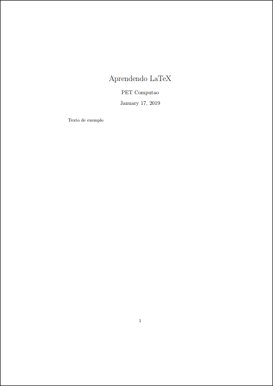
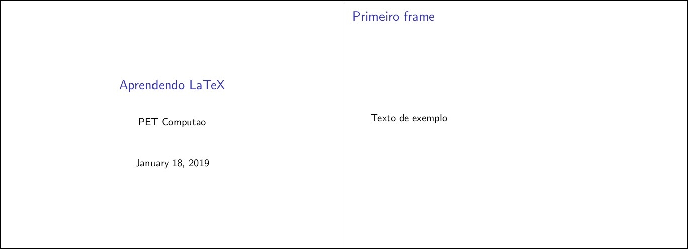

Preâmbulo: autor, título e data
===============================

Como visto no tópico anterior, o Preâmbulo é o que fica entre a definição da
classe e o documento. Nele vão:
- Os pacotes utilizados (serão vistos mais à frente);
- (Re)Definição de comandos, ambientes e _macros_.

Macros são nomes que serão substituídos por algum conteúdo quando o seu LaTeX
for compilado. Algumas _macros_ são, por exemplo, `\title`, `\author` e
`\date`, que representam respectivamente o título, autor e data do documento.

Essas macros podem ser definidas da seguinte forma:

```latex
\title{Título de exemplo}
\author{Autor exemplar}
\date{\today}
```

Perceba que em `\date` foi utilizada uma outra _macro_ como o valor. Essa macro
contém o dia em que o documento foi compilado, portanto ela muda toda vez que
você compilar em dias diferentes. Caso você queira especificar uma data, basta
escrevê-la por extenso:


Essas três macros serão úteis, por exemplo, quando você utilizar comandos como
o `\maketitle`, que, dependendo do tipo de documento e das especificações dos
pacotes, gera a parte de título do seu documento. No caso de um livro, isso
significa a capa. No caso de um artigo, significa a área inicial dele que
contém título, autores e etc. No caso de apresentações de slides, significa o
slide de abertura/título.

Prática
-------

1. Insira, depois da definição do `\documentclass{...}` e antes de
   `\begin{document}`, um título, autor e data apropriados para seu documento
   de exemplo.
2. Em seguida, no ambiente do conteúdo do documento, faça a primeira coisa (ou
   seja, antes mesmo do seu texto de exemplo) ser o comando `\maketitle`.
3. Por fim, compile e veja o resultado de seu documento.

Resultado
---------

### Com `article`

```latex
\documentclass{article}

\title{Aprendendo LaTeX}
\author{PET Computação}
\date{\today}

\begin{document}
    \maketitle

    Texto de exemplo
\end{document}
```



### Com `beamer`

```latex
\documentclass{beamer}

\title{Aprendendo LaTeX}
\author{PET Computação}
\date{\today}

\begin{document}
    \maketitle

    \begin{frame}{Primeiro frame}
        Texto de exemplo
    \end{frame}
\end{document}
```


