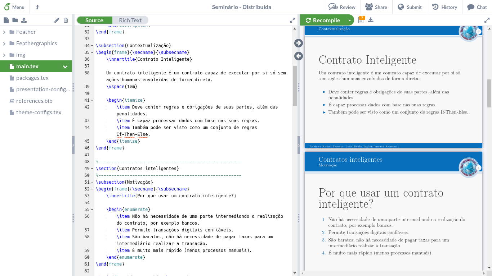

Ferramentas e documentação
==========================

Para começar a utilizar LaTeX, você pode utilizar o
[Overleaf](https://overleaf.com) (uma espécie de Google Docs para LaTeX) ou
editar a partir do seu próprio computador.

No caso do Overleaf, é questão de criar uma conta, criar um projeto e começar a
brincar.

No caso do seu computador, é necessário:
- Instalar alguma distribuição LaTeX;
- Escrever um arquivo de .tex como arquivo principal do documento;
- Compilar para gerar o .pdf (ou corrigir os erros apontados pelo compilador).

Você pode checar a seção [Editores](#editores) nesta página para ver quais as
possibilidades de aplicativos para editar LaTeX.

Distribuições
-------------

LaTeX vem em pacotes de ferramentas chamados de distribuições. Um resumo
retirado da documentação do Overleaf:

- **MiKTeX**: para Windows;
- **proTeXt**: também para Windows, baseado no MiKTeX;
- **TeX Live**: para Linux e outros sistemas Unix (ex: BSD);
- **MacTeX**: redistribuição do TeX Live para MacOS.

Para usuários de Windows, a distribuição **proTeXt** já inclui o MiKTeX, bem
como o editor TeXStudio, feito para LaTeX e outras ferramentas menores. O
MikTeX sozinho tem pouco menos de 200MB, enquanto o proTeXt chega a mais de
1GB. Sendo assim, decidir entre um e outro é avaliar o _tradeoff_ Armazenamento
x Recursos.

Independente de sua decisão de distribuição, é bem provável que você vá querer
ter o TeX Live, visto que é o mais ativo e preferido na comunidade, mas como
instalar em outro SO que não seja Unix é com você, portanto recomendo deixar
isso para mais tarde se parecer complicado e primeiro ter seu início no mundo
LaTeX.

Compiladores
------------

Se tratando de LaTeX, o compilador é um programa que irá pegar o seu código
LaTeX e gerar o documento em questão. Existem alguns compiladores mais
conhecidos, sendo eles:

- `latex`: Compilador mais simples, porém aceita apenas imagens nos formatos
  .eps e .ps.

- [pdfLaTeX](https://www.tug.org/applications/pdftex/): Suporta formatos mais
  comuns de imagem, como PNG, JPG, e mesmo outros PDFs.

- [XeLaTeX](https://www.overleaf.com/learn/latex/XeLaTeX): Suporta, além das
  mesmas coisas que o pdfLaTeX, UTF-8 nativamente e permite utilizar fontes TTF
  e OTF.

- [LuaTex](http://www.luatex.org/): Suporta, além das mesmas coisas que o
  XeLaTeX (com exceção de PostScript, uma linguagem feita para definição de
  layout de página para impressão - não significa que ela é obrigatória para
  gerar ou imprimir os PDFs), criar seus próprios comandos na linguagem Lua (em
  vez de LaTeX puro).

Mais informações sobre compiladores de LaTeX podem ser encontradas na
[documentação do Overleaf sobre
compiladores](https://www.overleaf.com/learn/latex/Choosing_a_LaTeX_Compiler)

Documentação recomendada
------------------------

Há duas recomendações de documentação para caso precise tirar dúvidas sobre
LaTeX:
1. As documentações do Overleaf (o que inclui um guia de [como aprender LaTeX
   em 30
   minutos](https://www.overleaf.com/learn/latex/Learn_LaTeX_in_30_minutes));
2. As documentações dos pacotes que for utilizar.

**Nota**: No caso do overleaf, perceba o índice à esquerda para ver que há
vários conteúdos interessantes para iniciantes.

As documentações dos pacotes costumam ficar disponíveis em PDF no
[CTAN](https://ctan.org/). Por exemplo, se vier na [documentação do
`booktabs`](https://ctan.org/pkg/booktabs), poderá ver que a documentação
principal dele está disponível em 3 línguas diferentes (inglês, francês e
espanhol). São esses PDFs de documentação que você deverá ler na maioria das
vezes, que conterão toda a descrição do pacote, seus objetivos, e como fazer
cada coisa que eles disponibilizam.

Editores
--------

Documentos LaTeX nada mais são do que arquivos de texto, padronizados com a
extensão ".tex". Então no fundo qualquer editor de texto serve, mas vale
lembrar que vários editores oferecem recursos que facilitam sua vida.

Editores específicos:
- [Overleaf](https://overleaf.com): Como apontado antes, é como um Google Docs
  para LaTeX. Funciona totalmente online, possui atalhos de teclado,
  compiladores, visualizador de PDF e etc. configurados prontamente sem que
  você precise fazer algo adicional. Pode ser ótimo para se aventurar com LaTeX
  sem se preocupar em adquirir ferramentas como TeX Live e semelhantes. Além
  disso, possui um sistema de colaboração em que várias pessoas podem editar o
  mesmo arquivo ao mesmo tempo. Também possui integração com repositórios do
  [GitLab](https://gitlab.com).

  

- [TeXStudio](https://www.texstudio.org/): Infelizmente não conheço do
  TeXStudio para dizer sobre ele, então sugiro ver a página oficial dele para
  mais detalhes. Se você já conhece o TeXStudio, sinta-se à vontade para fazer
  um Fork do [repositório de
  tutoriais](https://github.com/pet-comp-ufsc/tutorials) e enviar um Pull
  Request com suas alterações descrevendo melhor o editor.

Editores independentes:
- [VisualStudio Code](https://code.visualstudio.com/): Possui extensões para
  melhor uso de LaTeX, desde poder pré-visualizar seu documento e automatizar a
  compilação até destacar linhas com _warnings_ e erros de compilação. Veja
  imagens e recursos na [Página da extensão de LaTeX para
  VSCode](https://marketplace.visualstudio.com/items?itemName=James-Yu.latex-workshop)

Comunidade
----------

Por fim, é interessante estar atento à comunidade LaTeX:
- A nível internacional, você pode postar suas dúvidas no [LaTeX Stack
  Exchange](http://tex.stackexchange.com), sempre obedecendo às regras da
  comunidade.
- Ou você pode aproveitar também as comunidades brasileiras, como o
  [@latexbr](https://t.me/latexbr) no Telegram, sempre lembrando de ser
  receptivo e manter a ordem e bom convívio social.
