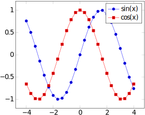

Por que utilizar LaTeX
======================

LaTeX (lê-se: Latek) é uma ferramenta para criação de documentos, podendo ser:

- Apresentações de slides;
- Relatórios de trabalhos de aula;
- Artigos científicos;
- Livros;
- Provas.

E ainda mais. Tudo isso levando em conta uma ótima qualidade de tipografia,
disposição dos elementos (evitando poluição visual, por exemplo), e outros
fatores relacionados a estética.

É possível ler mais sobre LaTeX na [página oficial do
projeto](https://www.latex-project.org/about/).

Então, seguem alguns dos motivos para se utilizar LaTeX:

### Qualidade tipográfica

Como mencionado anteriormente, LaTeX foca em ter uma qualidade tipográfica
excelente. Um PDF gerado com a ferramenta dificilmente terá algum serrilhado,
apresentará alguma deformação ou coisa do tipo. Isso se torna ainda melhor
quando se tratam de expressões matemáticas, como por exemplo:


Essa expressão é criada utilizando:

```latex
\begin{equation}
    \sigma_{prod}^{pA}(s) = \int_{0}^{\infty} 2\pi bdb
        \left\lbrace
            1 -
            \left[
                1 -
                \frac{T_{A}(b)\sigma_{inel}^{NN}(s)}{A}
            \right]
            ^{A}
        \right\rbrace
        \stackrel{A \gg 1}{\approx}
        2\pi\int_{0}^{\infty} bdb
        \left\lbrace
            1 -
            \exp\left[
                -T_{A}(b)
                \sigma_{inel}^{NN}(s)
            \right]
        \right\rbrace
\end{equation}
```

### Qualidade para gráficos/diagramas

Se você precisa plotar dados ou desenhar diagramas, LaTeX disponibiliza
componentes que são capazes de renderizá-los em alta qualidade. É possível,
inclusive, descrever os diagramas utilizando o próprio LaTeX, podendo ser até
Máquinas de Estado, ou mesmo gráficos 3D.

Um exemplo de plotagem de função:



Feita com:

```tex
\begin{tikzpicture}
    \begin{axis}[domain=-4:4, legend]
        \addplot {sin(deg(x))};
        \addplot {cos(deg(x))};

        \legend{
            $\sin(x)$,
            $\cos(x)$
        }
    \end{axis}
\end{tikzpicture}
```

### Se preocupe com o conteúdo, não a formatação

Este é um ponto que serve para entender como utilizar LaTeX: diferente de
programas como Microsoft Word ou Google Docs, a sua prioridade não será alterar
os mínimos detalhes para a formatação de margens, posicionamento de imagens,
etc., e sim com o conteúdo. Quem cuidará da formatação é o próprio LaTeX, o que
inclui deixar seu documento nas normas da ABNT! Vale lembrar que quem cuida do
projeto LaTeX são pessoas que entendem de tipografia, formatação e
apresentação, ou seja: não irão deixar a desejar nesses quesitos.

### Fácil gerenciamento de referências

Quem escreve documentos como artigos científicos sabe como referências são
importantes e, em muitos casos, difícieis de administrar. BibTeX, uma
ferramenta voltada a LaTeX, cuida delas automaticamente, bastando apenas
fornecer as informações das referências (título, autor, ano de publicação...).
E se a mesma referência for necessária em diferentes formatos (por exemplo,
publicar para dois _journals_ que cobram formatações de referência
específicas), basta apenas especificar qual o formato, sem que se tenha que
reescrever as referências.

### Fácil de citar referências

Assim como é fácil gerenciar as referências, citá-las também é. Por exemplo,
suponha que seu em seu projeto tenha a seguinte referência descrita com BibTeX:

```bibtex
@inproceedings{AwesomeAuthors:2018,
    title = {"An awesome article about BibTeX"},
    author = {"Mr. and Mrs. Awesome"},
    year = 2018,
}
```

Em qualquer momento do texto, é possível citá-lo como:

```tex
Segundo~\cite{AwesomeAuthors:2018}, fazer citações LaTeX é maravilhoso.
```

Isso irá, dependendo do formato de citações escolhido (ABNT ou IEEE, por
exemplo), colocar a citação corretamente. Se for um formato citações enumerado
(ou seja, em vez de "(Autor, ano)" ser "[1]", "[2]", etc.), a enumeração é
feita automaticamente.
